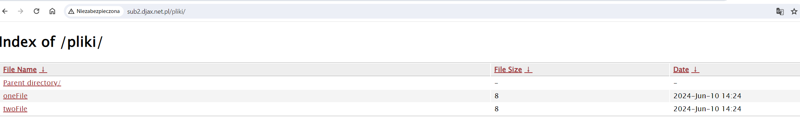
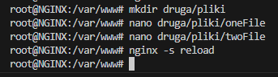

### aktywacja listowanie plików w podkatalogu (fragment /etc/nginx/sites-enabled/druga)

Należy dodać poniższą konfiguracje do ustawień strony druga

```
location /pliki {
		fancyindex on;
}
```

### to będzie efekt



### Stepy do wykonania


